# Quantum Diffusion Models
[](https://arxiv.org/abs/2504.00034v2)   
[](https://www.python.org/)
[](https://pytorch.org/)
[](https://pennylane.ai/)

The official implement of "Quantum Generative Models for Image Generation: Insights from MNIST and MedMNIST". A novel approach to image generation using quantum-enhanced diffusion models. This project implements diffusion models enhanced with quantum circuits for medical and standard image generation.

## 📋 Overview


This repository explores the integration of quantum computing into diffusion models for image generation. The implementation provides both classical and quantum-enhanced versions of diffusion models for MNIST and PathMNIST datasets.

Key features:
- Quantum-enhanced attention mechanism for diffusion models
- A four-arm ablation ladder (plain / classical-SE / frozen-SE / quantum) so the
  circuit's contribution can be separated from the gating's — see `bottlenecks.py`
- Evaluation metrics (FID, KID) computed from raw sample tensors (`evaluate.py`)
- Support for MNIST and PathMNIST medical datasets
- Data-scaling sweep over training-set size (`run_scaling_study.py`)

> **Status: results are being regenerated.** Two bugs (#1, #2) meant the quantum
> layer's variational parameters had identically zero gradient and the branch was
> detached from the autograd graph, so every previously published number compared
> a classical model against a model whose circuit was frozen at initialization. A
> third (#4) computed FID from images cropped out of saved matplotlib figures. All
> three are fixed on `main`; the numbers below have been removed rather than left
> standing. See issues #3 and #5 for the comparison design being run instead.

## 🚀 Models

### Diffusion Model Architecture
- **U-Net backbone** with residual blocks and skip connections
- **Flexible channels** for both MNIST (grayscale) and PathMNIST (RGB)
- **Timestep embedding** using sinusoidal positional encoding
- **Cosine beta scheduling** for improved sampling
- **Exponential Moving Average (EMA)** for stable training

### Quantum Enhancement
- **Hybrid quantum-classical model** with quantum attention layers
- **Parameterized quantum circuits** implemented using PennyLane
- **RY and RZ rotations** with CNOT entanglement structure
- **Quantum feature re-weighting** mechanism

## 💿 Datasets

### MNIST
- Standard handwritten digit recognition dataset
- Trained on individual digit classes (0-9)
- Grayscale images (1-channel, 28×28)

### PathMNIST
- Medical imaging dataset from MedMNIST collection
- Colorectal cancer histology patches
- RGB images (3-channel, 28×28)
- Class-conditional training

## 📊 Results

### Training Progression Comparison

The following GIFs demonstrate the training progression of both classical and quantum diffusion models for each MNIST digit. Notice how the models learn to generate increasingly refined digit representations over 30 epochs:

#### Digit 0
<table>
  <tr>
    <td><b>Classical Model</b></td>
    <td><b>Quantum Model</b></td>
  </tr>
  <tr>
    <td>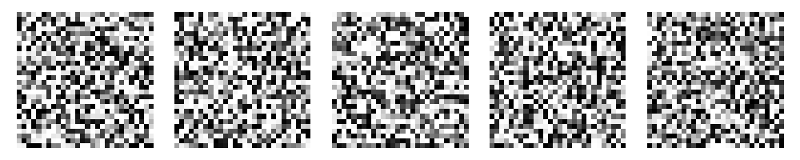</td>
    <td>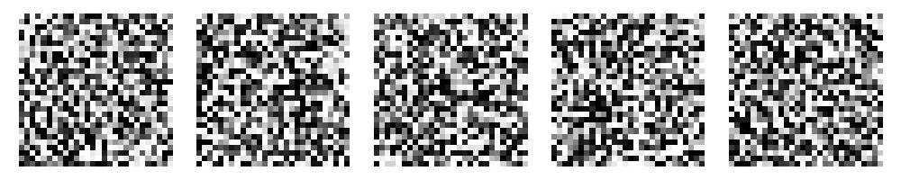</td>
  </tr>
</table>

#### Digit 1
<table>
  <tr>
    <td><b>Classical Model</b></td>
    <td><b>Quantum Model</b></td>
  </tr>
  <tr>
    <td>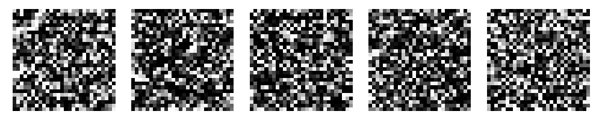</td>
    <td>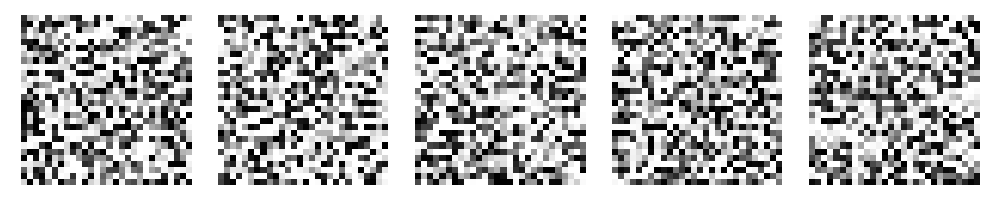</td>
  </tr>
</table>

#### Digit 2
<table>
  <tr>
    <td><b>Classical Model</b></td>
    <td><b>Quantum Model</b></td>
  </tr>
  <tr>
    <td>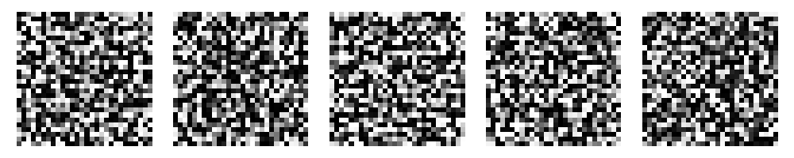</td>
    <td>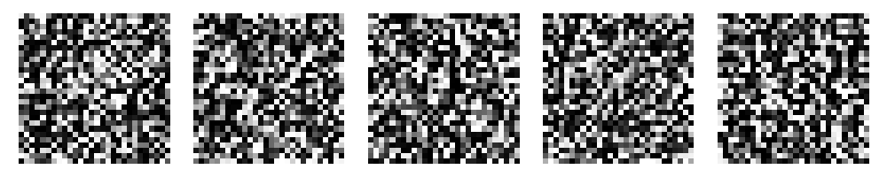</td>
  </tr>
</table>

#### Digit 3
<table>
  <tr>
    <td><b>Classical Model</b></td>
    <td><b>Quantum Model</b></td>
  </tr>
  <tr>
    <td>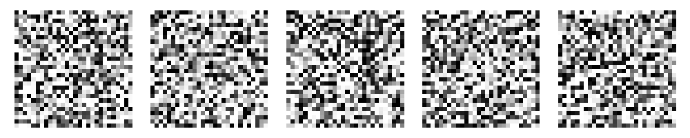</td>
    <td>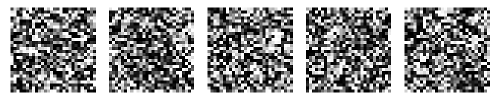</td>
  </tr>
</table>

#### Digit 4
<table>
  <tr>
    <td><b>Classical Model</b></td>
    <td><b>Quantum Model</b></td>
  </tr>
  <tr>
    <td>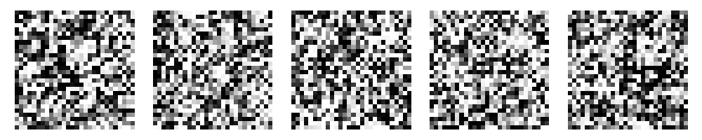</td>
    <td>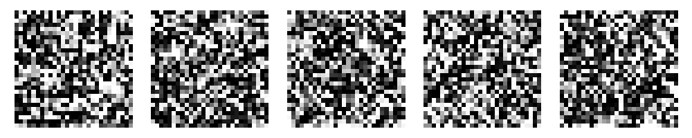</td>
  </tr>
</table>

#### Digit 5
<table>
  <tr>
    <td><b>Classical Model</b></td>
    <td><b>Quantum Model</b></td>
  </tr>
  <tr>
    <td>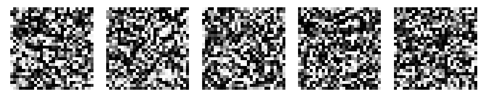</td>
    <td>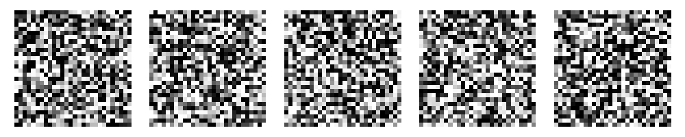</td>
  </tr>
</table>

#### Digit 6
<table>
  <tr>
    <td><b>Classical Model</b></td>
    <td><b>Quantum Model</b></td>
  </tr>
  <tr>
    <td>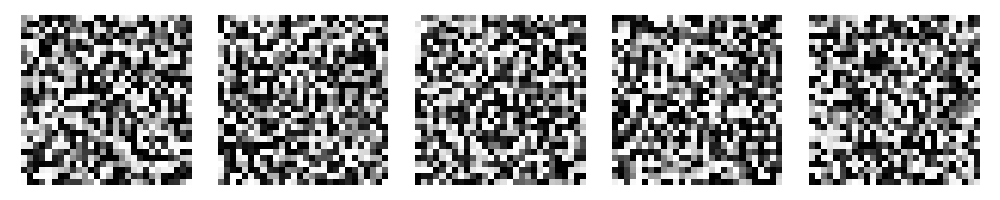</td>
    <td>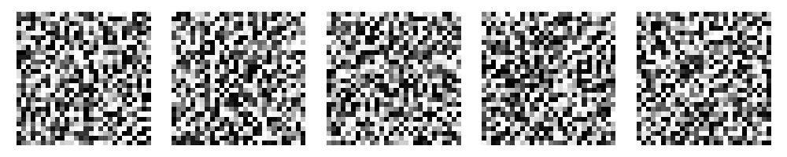</td>
  </tr>
</table>

#### Digit 7
<table>
  <tr>
    <td><b>Classical Model</b></td>
    <td><b>Quantum Model</b></td>
  </tr>
  <tr>
    <td>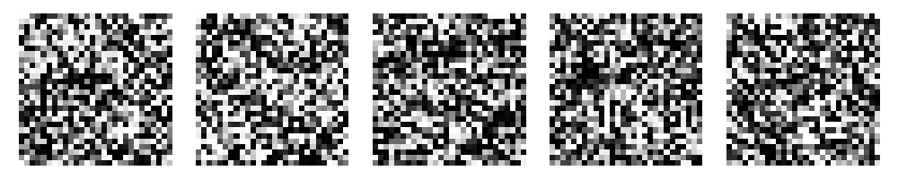</td>
    <td>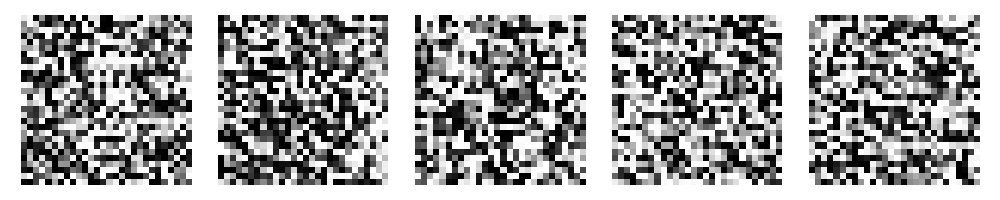</td>
  </tr>
</table>

#### Digit 8
<table>
  <tr>
    <td><b>Classical Model</b></td>
    <td><b>Quantum Model</b></td>
  </tr>
  <tr>
    <td>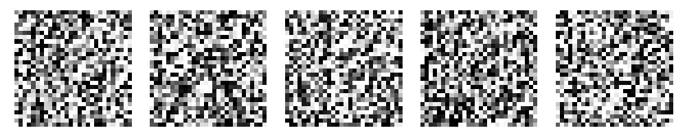</td>
    <td>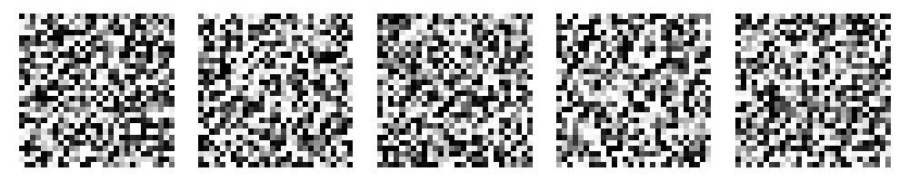</td>
  </tr>
</table>

#### Digit 9
<table>
  <tr>
    <td><b>Classical Model</b></td>
    <td><b>Quantum Model</b></td>
  </tr>
  <tr>
    <td>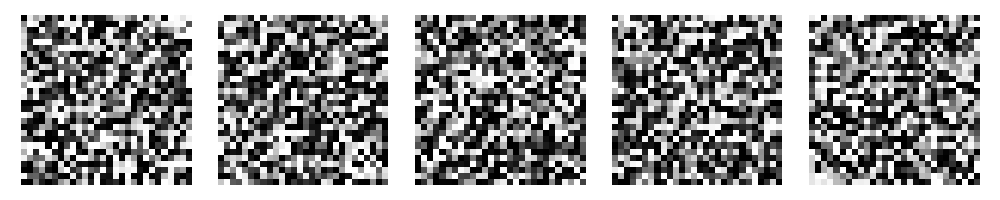</td>
    <td>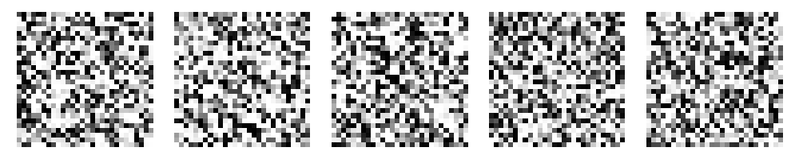</td>
  </tr>
</table>

### Quantitative Evaluation

Generated images are evaluated with `evaluate.py`, which reads the sampler's raw
output tensor:

- **Fréchet Inception Distance (FID)**: distance between the generated and real
  feature distributions. Biased at small sample counts — use ≥10k samples.
- **Kernel Inception Distance (KID)**: an unbiased estimator, far more stable at
  moderate N. Prefer it whenever fewer than ~10k samples are available.

**SSIM is deliberately not reported.** The previous scripts paired generated
sample *i* with real image *i* in dataset order, which a perfect generator would
also score near zero — it was never measuring generative quality. For a
fidelity-vs-diversity split, precision/recall or density/coverage is the right
replacement.

#### Results

Removed pending regeneration. The previously published FID/SSIM tables are not
reproducible and should not be cited:

- the quantum arm's circuit parameters had zero gradient (#1) and its input was
  detached from the graph (#2), so the "quantum" model was not the model
  described;
- FID was computed from ~13 fragments cropped out of a 5-sample matplotlib
  figure (#4), estimating a 2048×2048 covariance from 13 vectors;
- the classical baseline had no bottleneck module at all, making it an
  unmatched control (#3).

## 🔧 Implementation

### Training
```python
# The v7 MNIST script takes real flags (it previously had none -- the arm was
# chosen by editing the source, and the loop skipped digit 0).
# One arm of the ablation ladder at a time:
python quantum_difussion_mnist_v7.py --arm quantum --digits 3 --max-steps 2000
python quantum_difussion_mnist_v7.py --arm se      --digits 3 --max-steps 2000

# `se` is the parameter-matched classical control; `plain` has NO gating module
# and is therefore not a matched control. `se_frozen` freezes the down-projection.
python quantum_difussion_mnist_v7.py --help

# Low-data regime (issue #5): N images per class, seeded subset
python quantum_difussion_mnist_v7.py --arm quantum --digits 3 \
    --n-train 100 --max-steps 2000 --seed 0

# The quantum arm is ~350x slower per step than the classical arms.
# lightning.qubit + adjoint is ~3.5x faster than the default and numerically
# equivalent (verified to ~5e-07 on gradients):
python quantum_difussion_mnist_v7.py --arm quantum --digits 3 \
    --qdevice lightning.qubit --diff-method adjoint

# Enumerate the full scaling grid, with a cost estimate, before running it:
python run_scaling_study.py --digits 3 --dry-run

# The v8 full U-Net and the PathMNIST script take the same --arm flag.
# Note v8 has only three arms: its circuit pools its own input, so there is no
# down-projection to freeze and `se_frozen` does not apply there.
python full_unet/quantum_diffusion_mnist_v8.py --arm se --digits 3 --n-train 100
python quantum_difussion_pathmnist_v7.py       --arm se --label 1 --n-train 100
```

#### Arms, per script

| script | `plain` | `se` | `se_frozen` | `quantum` | step budget |
|---|---|---|---|---|---|
| `quantum_difussion_mnist_v7.py` | ✓ | ✓ | ✓ | ✓ | `--max-steps` |
| `quantum_difussion_pathmnist_v7.py` | ✓ | ✓ | ✓ | ✓ | `--max-steps` |
| `full_unet/quantum_diffusion_mnist_v8.py` | ✓ | ✓ | — | ✓ | `--max-steps` |

`se` is parameter-matched to `quantum` in all three — they differ by exactly the
96 circuit weights. For v8 that requires the classical arm to reduce by pooling
rather than by a `Linear`, since v8's circuit has no `input_proj`; a `Linear`
there would quietly hand the classical arm 2 064 parameters the quantum arm does
not have.

**Use `--max-steps`, not `--epochs`, for anything that varies `--n-train`.** At
N=10 an epoch is a single gradient step, so an epoch budget leaves the low-N arms
undertrained rather than data-limited, and the resulting curve conflates "less
data" with "fewer updates". All three scripts take a step budget;
`run_scaling_study.py` emits one and warns if pointed at a script that lacks it.

### Evaluation
```bash
# 1. sample from a checkpoint into a raw [N, C, 28, 28] tensor
python generate_samples.py --arch v7_mnist --use-quantum \
    --checkpoint runs/mnist_3_quantum_nall_s0/best_model.pth \
    --n 10000 --out samples/q_mnist3.pt

# 2. FID + KID against the real data, both sides converted identically
python evaluate.py --generated samples/q_mnist3.pt --dataset mnist --label 3
```

`cal_fid_ssim.py`, `cal_fid_ssim_medmnist.py` and
`full_unet/calculate_metrics_all_digits.py` are **deprecated** — they recover
"generated images" by cropping them out of a saved matplotlib figure (#4). They
are kept only so the numbers once quoted in this README can be traced to the code
that produced them.

## 📦 Installation

```bash
# Clone the repository
git clone https://github.com/ChiShengChen/Quantum_MNIST_Diffusion.git
cd Quantum_MNIST_Diffusion

# Create a conda environment
conda create -n quantum-diffusion python=3.8
conda activate quantum-diffusion

# Install dependencies
pip install torch torchvision tqdm matplotlib pennylane medmnist scikit-image scipy
```

## 📝 Citation

If you use this code for your research, please cite:

```
@article{chen2025quantum,
  title={Quantum Generative Models for Image Generation: Insights from MNIST and MedMNIST},
  author={Chen, Chi-Sheng and Hou, Wei An and Hu, Siang-Wei and Cai, Zhen-Sheng},
  journal={arXiv preprint arXiv:2504.00034},
  year={2025}
}
```

## 📄 License

This project is licensed under the MIT License - see the LICENSE file for details. 
