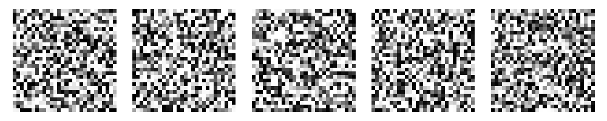

# Quantum Diffusion Models
[](https://arxiv.org/abs/2504.00034)  
[](https://www.python.org/)
[](https://pytorch.org/)
[](https://pennylane.ai/)

The official implement of Quantum Generative Models for Image Generation: Insights from MNIST and MedMNIST. A novel approach to image generation using quantum-enhanced diffusion models. This project implements diffusion models enhanced with quantum circuits for medical and standard image generation.

## 📋 Overview


This repository explores the integration of quantum computing into diffusion models for image generation. The implementation provides both classical and quantum-enhanced versions of diffusion models for MNIST and PathMNIST datasets.

Key features:
- Quantum-enhanced attention mechanism for diffusion models
- Classical vs quantum model comparison framework
- Evaluation metrics (FID, SSIM) for generated images
- Support for MNIST and PathMNIST medical datasets
- *We trained the quantum diffusion model with fewer than 100 images, demonstrating the advantage of quantum layers in low-data regimes.*

## 🚀 Models

### Diffusion Model Architecture
- **U-Net backbone** with residual blocks and skip connections
- **Flexible channels** for both MNIST (grayscale) and PathMNIST (RGB)
- **Timestep embedding** using sinusoidal positional encoding
- **Cosine beta scheduling** for improved sampling
- **Exponential Moving Average (EMA)** for stable training

### Quantum Enhancement
- **Hybrid quantum-classical model** with quantum attention layers
- **Parameterized quantum circuits** implemented using PennyLane
- **RY and RZ rotations** with CNOT entanglement structure
- **Quantum feature re-weighting** mechanism

## 💿 Datasets

### MNIST
- Standard handwritten digit recognition dataset
- Trained on individual digit classes (0-9)
- Grayscale images (1-channel, 28×28)

### PathMNIST
- Medical imaging dataset from MedMNIST collection
- Colorectal cancer histology patches
- RGB images (3-channel, 28×28)
- Class-conditional training

## 📊 Results

### Training Progression Comparison

The following GIFs demonstrate the training progression of both classical and quantum diffusion models for each MNIST digit. Notice how the models learn to generate increasingly refined digit representations over 30 epochs:

#### Digit 0
<table>
  <tr>
    <td><b>Classical Model</b></td>
    <td><b>Quantum Model</b></td>
  </tr>
  <tr>
    <td></td>
    <td></td>
  </tr>
</table>

#### Digit 1
<table>
  <tr>
    <td><b>Classical Model</b></td>
    <td><b>Quantum Model</b></td>
  </tr>
  <tr>
    <td></td>
    <td></td>
  </tr>
</table>

#### Digit 2
<table>
  <tr>
    <td><b>Classical Model</b></td>
    <td><b>Quantum Model</b></td>
  </tr>
  <tr>
    <td></td>
    <td></td>
  </tr>
</table>

#### Digit 3
<table>
  <tr>
    <td><b>Classical Model</b></td>
    <td><b>Quantum Model</b></td>
  </tr>
  <tr>
    <td></td>
    <td></td>
  </tr>
</table>

#### Digit 4
<table>
  <tr>
    <td><b>Classical Model</b></td>
    <td><b>Quantum Model</b></td>
  </tr>
  <tr>
    <td></td>
    <td></td>
  </tr>
</table>

#### Digit 5
<table>
  <tr>
    <td><b>Classical Model</b></td>
    <td><b>Quantum Model</b></td>
  </tr>
  <tr>
    <td></td>
    <td></td>
  </tr>
</table>

#### Digit 6
<table>
  <tr>
    <td><b>Classical Model</b></td>
    <td><b>Quantum Model</b></td>
  </tr>
  <tr>
    <td></td>
    <td></td>
  </tr>
</table>

#### Digit 7
<table>
  <tr>
    <td><b>Classical Model</b></td>
    <td><b>Quantum Model</b></td>
  </tr>
  <tr>
    <td></td>
    <td></td>
  </tr>
</table>

#### Digit 8
<table>
  <tr>
    <td><b>Classical Model</b></td>
    <td><b>Quantum Model</b></td>
  </tr>
  <tr>
    <td></td>
    <td></td>
  </tr>
</table>

#### Digit 9
<table>
  <tr>
    <td><b>Classical Model</b></td>
    <td><b>Quantum Model</b></td>
  </tr>
  <tr>
    <td></td>
    <td></td>
  </tr>
</table>

### Quantitative Evaluation

The project evaluates generated images using:
- **Fréchet Inception Distance (FID)**: measures the similarity between generated and real image distributions
- **Structural Similarity Index (SSIM)**: measures the perceptual difference between images

Sample results comparing classical and quantum models:
| Model | Dataset | FID↓ | SSIM↑ |
|-------|---------|------|-------|
| Classical | MNIST | 271.05 | 0.1085 |
| Quantum | MNIST | 259.25 | 0.1263 |
| Classical | PathMNIST | 95.72 | 0.4107 |
| Quantum | PathMNIST | 84.40 | 0.0931 |

## 🔧 Implementation

### Training
```python
# Train classical diffusion model on MNIST
python quantum_difussion_mnist_v7.py  # --use_quantum=False

# Train quantum diffusion model on MNIST
python quantum_difussion_mnist_v7.py  # --use_quantum=True

# Train on PathMNIST
python quantum_difussion_pathmnist_v7.py  # --use_quantum=True/False
```

### Evaluation
```python
# Evaluate generated PathMNIST samples
python cal_fid_ssim_medmnist.py

# Evaluate generated MNIST samples
python cal_fid_ssim.py

# Debug image splitting for FID calculation
python debug_img.py
```

## 📦 Installation

```bash
# Clone the repository
git clone https://github.com/yourusername/quantum-diffusion.git
cd quantum-diffusion

# Create a conda environment
conda create -n quantum-diffusion python=3.8
conda activate quantum-diffusion

# Install dependencies
pip install torch torchvision tqdm matplotlib pennylane medmnist scikit-image scipy
```

## 📝 Citation

If you use this code for your research, please cite:

```
@misc{quantum-diffusion,
  author = {Your Name},
  title = {Quantum-Enhanced Diffusion Models},
  year = {2023},
  publisher = {GitHub},
  journal = {GitHub repository},
  howpublished = {\url{https://github.com/yourusername/quantum-diffusion}}
}
```

## 📄 License

This project is licensed under the MIT License - see the LICENSE file for details. 
